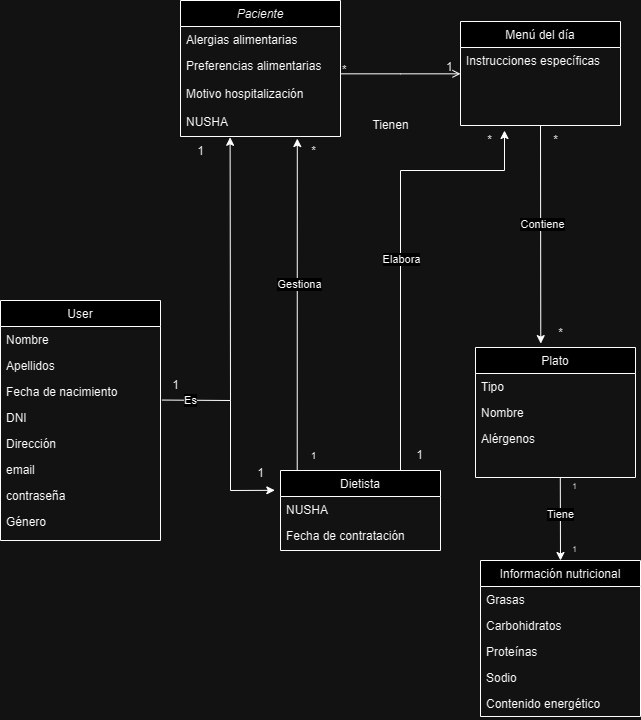

# CGIS - Proyecto evaluación continua

# Gestión de comedor de hospital
## Integrantes
- Alfonso Ibáñez Rodríguez: [@alibauez](https://github.com/alibauez)
- Alberto García Mármol: [@albgarmar2502](https://github.com/albgarmar2502)

## Dominio

El sistema de gestión del comedor en un hospital es una herramienta indispensable para asegurar una atención integral y personalizada a los pacientes en cuanto a su alimentación y nutrición. Es importante garantizar que cada paciente reciba la cantidad adecuada de macronutrientes según sus necesidades dietéticas individuales, alergias, dolencias alimentarias y/o médicas.

El proceso de gestión del comedor involucra múltiples actividades, desde la planificación y preparación de menús hasta la distribución de las comidas y el seguimiento del cumplimiento de las dietas prescritas. Estas actividades son llevadas a cabo por diferentes profesionales y personal médico en el hospital.

Los principales desafíos que enfrenta el sistema de gestión del comedor incluyen la necesidad de optimizar la cantidad de alimentos necesarios para cada paciente, minimizar errores en la distribución de comidas, garantizar la seguridad alimentaria y cumplir con las restricciones dietéticas de los pacientes.

Además, el sistema debe ser capaz de adaptarse a las necesidades cambiantes de los pacientes, como dietas especiales para pacientes en recuperación de cirugías o procedimientos médicos, así como también permitir la inclusión de preferencias dietéticas religiosas y alergias alimentarias.

La aplicación propuesta tiene como objetivo abordar estos desafíos proporcionando una plataforma centralizada y fácil de usar e intuitiva para todo tipo de personas, que permita a los diferentes usuarios del sistema colaborar eficientemente en la gestión del comedor hospitalario. Al permitir la introducción de datos sobre alergias y dolencias alimentarias por parte del dietista, así como la elaboración de planes personalizados para cada paciente, el sistema garantizará una atención nutricional adecuada y segura para todos los pacientes.

## OBJETIVOS:
- Facilitar la gestión del comedor, y optimizar los platos específicos a necesitar para cada paciente y evitar errores.
- Permitir que el dietista pueda introducir en los datos del paciente sus alergías y/o dolencias alimentarias.
- Permitir que el sistema pueda elaborar un plan personalizado para cada paciente.

## Usuarios del sistema
- Administrador 
- Paciente
- Dietista
  

## Requisitos de información
- **RI001. Información sobre los usuarios**: El sistema deberá almacenar datos personales sobre todos los usuarios del sistema: correo electrónico, contraseña, nombre, edad, fecha de nacimiento, DNI, género..(añadir mas)
- **RI002. Información sobre los dietistas**: El sistema deberá almacenar datos específicos de los dietistas: nuhsa, fecha de contratación..(añadir mas)
- **RI003. Información sobre los pacientes**: El sistema deberá almacenar datos específicos de los pacientes: alergias alimentarias, preferencias alimentarias, motivo de hospitalización..(añadir mas)
- **RI004. Información sobre el menú del día**: El sistema deberá almacenar información sobre los diferentes menús, como las instrucciones específicas y la fecha.
- **RI005. Información sobre el plato**: El sistema deberá almacenar información sobre cada plato: nombre, tipo (primero, segundo o postre), descripción, ingredientes, peso, calorías, proteínas, grasas, carbohidratos, fibra, azúcares, alérgenos.
(podriamos añadir la fecha de produccion del plato, para no usar un plato que lleve mas de dos días hecho)

  
## Requisitos funcionales
- **RF1**: Para todos los usuarios: Queremos que el sistema nos permita  registrarnos con el correo electrónico y con una contraseña y acceder al sistema.
- **RF2**: Como usuario principal, quiero crear, editar y eliminar perfiles.
- **RF3**: Como dietista, quiero poder diseñar planes de alimentación personalizados para cada paciente, basandome en su estado de salud, alergias alimentarias y preferencias dietéticas.
- **RF4**: Como dietista, quiero tener un listado con las diferentes restricciones alimentarias de los pacientes que gestiono.
- **RF5**: Como dietista, quiero ver el contenido energético completo de un menú.
- **RF6**: Como dietista, quiero consultar los alérgenos de un plato.
- **RF7**: Como dietista, quiero filtrar los platos que tienen una determinada característica (cierto alérgeno, demasiadas kcal...)
- **RF8**: Como dietista, quiero ver todos los pacientes que gestiono sus planes de alimentación.
- **RF9**: Como dietista, quiero consultar los platos disponibles.
- **RF10**: Como paciente, quiero poder realizar solicitudes de alimentos especiales a través del sistema, indicando mis preferencias o restricciones dietéticas. 
- **RF11**: Como paciente, quiero ver un histórico de mis ingestas alimentarias con un resumen nutricional.
  

## Reglas de Negocio
- **RN1**: Los dietistas solo podrán tener a su cargo a 25 pacientes.
- **RN2**: Los dietistas solo pueden acceder y modificar los planes de alimentación de los pacientes asignados a su cuidado y no a los pacientes de otro dietista.
- **RN3**: Un menu tiene que contener un primer plato, un segundo y postre.
- **RN4**: Un menu no podrá contener cierto alérgeno si el paciente tiene alergia a este.
- **RN5**: El dietista es el único usuario que podrá crear y editar el menú del día.

## Requisitos No Funcionales 
- **RNF1**: La interfaz de usuario debe ser intuitiva y fácil de usar para facilitar la adopción por parte de los usuarios, independientemente de su nivel de habilidad técnica.
- **RNF2**: El sistema debe ser seguro y proteger la privacidad de la información del paciente, cumpliendo con los estándares de seguridad y regulaciones de protección de datos.
- **RNF3**: El sistema debe estar siempre disponible para garantizar un acceso continuo y sin interrupciones a las funciones del sistema durante todo el día.
- **RNF4**: El sistema debe ser escalable para manejar un gran volumen de datos y usuarios simultáneos.
- **RNF5**: Debe ser compatible con diferentes dispositivos y navegadores web para permitir el acceso desde múltiples plataformas y dispositivos.
- **RNF6**: El tiempo de respuesta del sistema debe ser rápido y eficiente, asegurando una experiencia de usuario fluida.
- **RNF7**: Debe ser fácilmente mantenible y actualizable para permitir la incorporación de nuevas funcionalidades y corrección de errores de manera oportuna.
- **RNF8**: El sistema debe evitar la creación de un nuevo usuario con un email ya en uso.

## Modelado conceptual en UML

## Manual de usuario con capturas. 
- NO ES PARA LA PRIMERA ENTREGA

## Policies (Sucio)

Administrador: tiene acceso a todo.

Paciente: solo puede registrarse, editar sus datos personales y ver sus menus.

Dietista: Puede crear y editar platos, menus, podrá editar sus datos personales y solo ver datos del paciente. Podra asignar los menus completos al los pacientes

Hay que añadir obligatoriamente 1 primer plato, un segundo y un postre a un menu, si no saltara una alerta y no deja.

El sistema solamente deja añadir menus completos a los pacientes. 

Al ver en detalle un menu, salen ordenados por la categoria de plato
