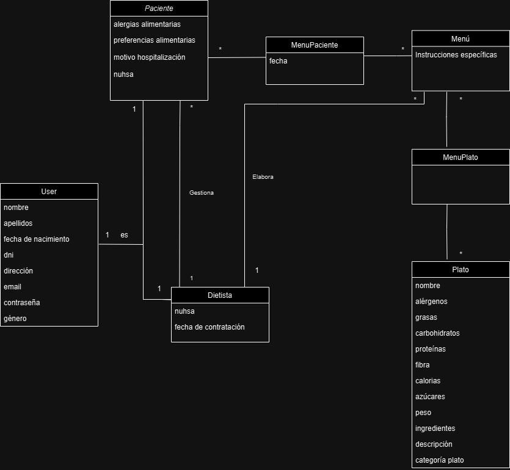

# CGIS - Proyecto evaluación continua

# Gestión de comedor de hospital
## Integrantes
- Alfonso Ibáñez Rodríguez: [@alibauez](https://github.com/alibauez)
- Alberto García Mármol: [@albgarmar2502](https://github.com/albgarmar2502)

## Dominio

El sistema de gestión del comedor en un hospital es una herramienta indispensable para asegurar una atención integral y personalizada a los pacientes en cuanto a su alimentación y nutrición. Es importante garantizar que cada paciente reciba la cantidad adecuada de macronutrientes según sus necesidades dietéticas individuales, alergias, dolencias alimentarias y/o médicas.

El proceso de gestión del comedor involucra múltiples actividades, desde la planificación y preparación de menús hasta la distribución de las comidas y el seguimiento del cumplimiento de las dietas prescritas. Estas actividades son llevadas a cabo por diferentes profesionales y personal médico en el hospital.

Los principales desafíos que enfrenta el sistema de gestión del comedor incluyen la necesidad de optimizar la cantidad de alimentos necesarios para cada paciente, minimizar errores en la distribución de comidas, garantizar la seguridad alimentaria y cumplir con las restricciones dietéticas de los pacientes.

Además, el sistema debe ser capaz de adaptarse a las necesidades cambiantes de los pacientes, como dietas especiales para pacientes en recuperación de cirugías o procedimientos médicos, así como también permitir la inclusión de preferencias dietéticas religiosas y alergias alimentarias.

La aplicación propuesta tiene como objetivo abordar estos desafíos proporcionando una plataforma centralizada y fácil de usar e intuitiva para todo tipo de personas, que permita a los diferentes usuarios del sistema colaborar eficientemente en la gestión del comedor hospitalario. Al permitir la introducción de datos sobre alergias y dolencias alimentarias por parte del dietista, así como la elaboración de planes personalizados para cada paciente, el sistema garantizará una atención nutricional adecuada y segura para todos los pacientes.

## OBJETIVOS:

El objetivo de la aplicación es mejorar la gestión de la alimentación en el entorno hospitalario al facilitar la administración y personalización de menús para pacientes hospitalizados, garantizando que estos sean adecuados a las necesidades dietéticas específicas de cada individuo. Además, busca optimizar la comunicación entre administradores, pacientes y dietistas al proporcionar una plataforma centralizada para el intercambio de información relevante sobre la alimentación y las preferencias de los pacientes, contribuyendo así a promover la salud y el bienestar de los pacientes, incrementar la eficiencia en la planificación de dietas hospitalarias, y mejorar la experiencia global de los usuarios dentro del hospital.

**OBJ-1. Mejorar la Gestión de la Alimentación en el Hospital:**

Facilitar la administración y personalización de menús para pacientes hospitalizados y asegurar que los menús sean adecuados para las necesidades dietéticas específicas de cada paciente.

**OBJ-2. Optimizar la Comunicación entre Administradores, Pacientes y Dietistas::**

Proporcionar una plataforma centralizada para el intercambio de información relevante sobre la alimentación y las preferencias de los pacientes.

## Usuarios del sistema
- Administrador 
- Paciente
- Dietista
 

## Requisitos de información

- **RI001. Información sobre los usuarios**: El sistema deberá almacenar datos personales sobre todos los usuarios del sistema: correo electrónico, contraseña, nombre, edad, fecha de nacimiento, DNI, género y dirección
- **RI002. Información sobre los dietistas**: El sistema deberá almacenar datos específicos de los dietistas: nuhsa y fecha de contratación.
- **RI003. Información sobre los pacientes**: El sistema deberá almacenar datos específicos de los pacientes: alergias alimentarias, preferencias alimentarias, motivo de hospitalización y nuhsa.
- **RI004. Información sobre el menú**: El sistema deberá almacenar información sobre los diferentes menús, como las instrucciones específicas y también la fecha al asociarlo a un paciente.
- **RI005. Información sobre el plato**: El sistema deberá almacenar información sobre cada plato: nombre, tipo (primero, segundo o postre), descripción, ingredientes, peso, calorías, proteínas, grasas, carbohidratos, fibra, azúcares, alérgenos.

  
## Requisitos funcionales

- **RF-001. Registro de usuarios: (todos los roles)**: Como usuario quiero que el sistema me permita registrarme con mis credenciales y acceder al sistema.
- **RF-002. Visualización y modificación de perfiles (todos los roles)**: Como usuario quiero que el sistema me permita visualizar y modificar la información de mi perfil como nombre, email y contraseña.
- **RF-003. Eliminación de cuenta (todos los roles)**: Como usuario quiero que el sistema me permita eliminar mi cuenta.

**ADMINISTRADOR**

- **RF4. Creación de pacientes**: Como administrador quiero poder crear un usuario paciente con sus credenciales y poder asociarle una contraseña.
- **RF5. Edición de pacientes**: Como administrador quiero poder editar todos los datos de un usuario paciente.
- **RF6. Eliminación de pacientes**: Como administrador quiero poder eliminar todos los datos de un usuario paciente.
- **RF7. Visualización de pacientes**: Como administrador quiero poder ver toda la información de un paciente.
- **RF8. Gestión de menús**: Como administrador quiero poder crear, eliminar y editar un menú, pudiendo modificar el dietista asociado a este.
- **RF9. Gestión de platos**: Como administrador quiero poder crear, editar y eliminar un plato.
- **RF10. Visualización de menús**: Como administrador quiero poder ver toda la información de un menú.
- **RF11. Visualización de platos**: Como administrador quiero poder ver toda la información de un plato.
- **RF12. Asociación de menú a paciente**: Como administrador quiero poder asociarle un menú a un paciente y añadirle una fecha.
- **RF13. Disociar menú de paciente**: Como administrador quiero poder desasociar un menú de un paciente.
- **RF14. Asociaciar un plato a un menú**: Como administrador quiero poder asociarle un plato a un menú.
- **RF15. Disociar plato de menu**: Como administrador quiero poder desasociar un plato de un menú.

**PACIENTE**

- **RF16. Visualización de mis menús**: Como paciente quiero poder ver la información sobre mis menús.

**DIETISTA**

- **RF17. Edición de mis pacientes**: Como dietista quiero poder editar los datos de mis paciente.
- **RF18. Eliminación de mis pacientes**: Como dietista quiero poder eliminar todos los datos de mis pacientes.
- **RF19. Visualización de mis pacientes**: Como dietista quiero poder ver toda la información de mis paciente.
- **RF20. Gestión de mis menús**: Como dietista quiero poder crear, eliminar y editar mis menús.
- **RF21. Gestión de mis platos**: Como dietista quiero poder crear, editar y eliminar mis platos.
- **RF22. Visualización de mis menús**: Como dietista quiero poder ver toda la información de mis menús.
- **RF23. Visualización de mis platos**: Como dietista quiero poder ver toda la información de mis platos, entre ellas los alérgenos que contiene.
- **RF24. Asociación de menú a mis paciente**: Como dietista quiero poder asociarle un menú a uno de mis pacientes y añadirle una fecha.
- **RF25. Disociar menú de mis paciente**: Como dietista quiero poder desasociar un menú de uno de mis pacientes.
- **RF26. Asociaciar un plato a mis menú**: Como dietista quiero poder asociarle un plato a uno de mis menús.
- **RF27. Disociar plato de mis menu**: Como dietista quiero poder desasociar un plato de uno de mis menús.

## Reglas de Negocio
- **RN1**: Los dietistas solo podrán acceder a la información de sus pacientes.
- **RN2**: Los dietistas solo podrán editar la información de sus pacientes.
- **RN3**: Los dietistas solo podrán eliminar sus pacientes.
- **RN4**: Los dietistas solo podrán acceder a la información de sus menús.
- **RN5**: Los dietistas solo podrán asociar y desasociar menús a sus pacientes.
- **RN6**: Los dietistas solo podrán asociar y desasociar platos a sus menús.
- **RN7**: Los pacientes solo podrán ver sus menús asociados.
- **RN8**: Para que un menú esté completo, debe contener un primero, un segundo y un postre.
- **RN9**: Solo se podrá asociar un menú a un paciente si este está completo.
- **RN10**: No se puede asociar un menú que ya está asociado al paciente, antes deberá ser eliminado.
- **RN11**: Los dietistas solo podrán asociar y desasociar menús a sus pacientes.
- **RN12**: Al editar y visualizar un menú, la categoría de los platos debe estar ordenada en orden de: Primero, Segundo y Postre.
- **RN13**: Los Pacientes solo podrán ver los menús con fecha de hoy en adelante. 

## Requisitos No Funcionales 
- **RNF1**: La interfaz de usuario debe ser intuitiva y fácil de usar para facilitar la adopción por parte de los usuarios, independientemente de su nivel de habilidad técnica.
- **RNF2**: El sistema debe ser seguro y proteger la privacidad de la información del paciente, cumpliendo con los estándares de seguridad y regulaciones de protección de datos.
- **RNF3**: El sistema debe estar siempre disponible para garantizar un acceso continuo y sin interrupciones a las funciones del sistema durante todo el día.
- **RNF4**: El sistema debe ser escalable para manejar un gran volumen de datos y usuarios simultáneos.
- **RNF5**: El tiempo de respuesta del sistema debe ser rápido y eficiente, asegurando una experiencia de usuario fluida.
- **RNF6**: Debe ser fácilmente mantenible y actualizable para permitir la incorporación de nuevas funcionalidades y corrección de errores de manera oportuna.
- **RNF7**: El sistema debe evitar la creación de un nuevo usuario con un email ya en uso.
- **RNF8**: El sistema debe de tener una disponibilidad del 99,96%.

## Modelado conceptual en UML

