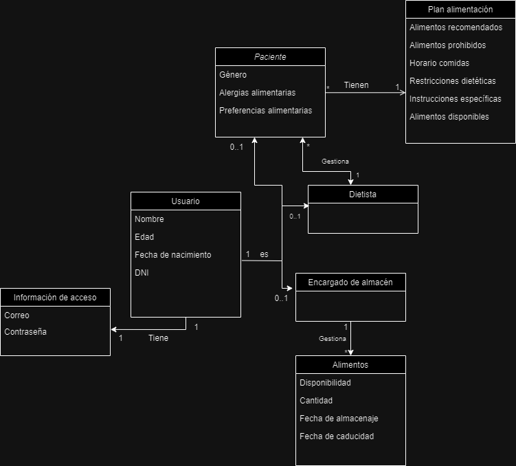

# CGIS - Proyecto evaluación continua

# Gestión de comedor de hospital
## Integrantes
- Alfonso Ibáñez Rodríguez
- Alberto García Mármol

## Dominio

El sistema de gestión del comedor en un hospital es una herramienta indispensable para asegurar una atención integral y personalizada a los pacientes en cuanto a su alimentación y nutrición. Es importante garantizar que cada paciente reciba la cantidad adecuada de alimentos según sus necesidades dietéticas individuales, alergias, dolencias alimentarias y/o médicas.

El proceso de gestión del comedor involucra múltiples actividades, desde la planificación y preparación de menús hasta la distribución de las comidas y el seguimiento del cumplimiento de las dietas prescritas. Estas actividades son llevadas a cabo por diferentes profesionales y personal médico en el hospital, incluyendo dietistas, personal de cocina, encargados de almacén, etc.

Los principales desafíos que enfrenta el sistema de gestión del comedor en este incluyen la necesidad de optimizar la cantidad de alimentos necesarios para cada paciente, minimizar errores en la distribución de comidas, garantizar la seguridad alimentaria y cumplir con las restricciones dietéticas de los pacientes.

Además, el sistema debe ser capaz de adaptarse a las necesidades cambiantes de los pacientes, como dietas especiales para pacientes en recuperación de cirugías o procedimientos médicos, así como también permitir la inclusión de preferencias dietéticas religiosas y alergias alimentarias.

La aplicación propuesta tiene como objetivo abordar estos desafíos proporcionando una plataforma centralizada y fácil de usar e intuitiva para todo tipo de personas, que permita a los diferentes usuarios del sistema colaborar eficientemente en la gestión del comedor hospitalario. Al permitir la introducción de datos sobre alergias y dolencias alimentarias por parte del dietista, así como la elaboración de planes personalizados para cada paciente, el sistema garantizará una atención nutricional adecuada y segura para todos los pacientes. Además, al facilitar la gestión del inventario y la programación de dietas especiales, el sistema ayudará a optimizar los recursos y mejorar la experiencia general de los pacientes.

## OBJETIVOS:
- Facilitar la gestión del comedor, y optimizar la cantidad de comida específica a necesitar para cada paciente y evitar errores 
- Permitir que el dietista pueda introducir en los datos del paciente sus alergías y/o dolencias alimentarias.
- Permitir que el sistema pueda elaborar un plan personalizado para cada paciente.
- Mejorar la eficiencia en la gestión de inventario: Implementar herramientas que permitan al encargado de almacén monitorear y gestionar el inventario de alimentos de manera más eficiente, asegurando un abastecimiento oportuno y evitando desperdicios.

## Usuarios del sistema
- Administrador 
- Dietista 
- Encargado de almacén

## Requisitos de información
- **RI1**: Información de acceso: El sistema deberá almacenar la información de acceso de todos los usuarios: correo y contraseña
- **RI2**: Información de usuario: El sistema deberá almacenar una cierta información sobre cada usuario: nombre, edad, fecha de nacimiento, DNI. 
- **RI3**: Información del almacén: El sistema deberá almacenar información sobre el almacén de alimentos con atributos como: Disponibilidad, cantidad, fecha de almacenaje, fecha de caducidad. Para cada alimento.
- **RI4**: Información del paciente: El sistema deberá almacenar información sobre los pacientes del hospital: Nombre, edad, género, alergias alimentarias, preferencias alimentarias.
- **RI5**: Planes de alimentación: El sistema deberá almacenar información sobre los diferentes planes de alimentación: Alimentos recomendados, alimentos prohibidos, horario comidas, 
restricciones dietéticas, instrucciones específicas, alimentos disponibles.

  
## Requisitos funcionales
- **RF1**: El sistema debe permitir la creación, edición y eliminación de perfiles de pacientes, incluyendo información sobre alergias alimentarias, dolencias médicas y preferencias dietéticas.
- **RF2**: El sistema debe poder diseñar planes de alimentación personalizados para cada paciente, basados en su estado de salud, alergias alimentarias y preferencias dietéticas.
- **RF3**: El sistema debe permitir la definición y programación de menús diarios, semanales o mensuales, teniendo en cuenta las necesidades dietéticas y preferencias de los pacientes.
- **RF4**: Debe haber una funcionalidad para registrar las entradas y salidas de alimentos en el almacén, manteniendo actualizado el inventario en todo momento.
- **RF5**: Los pacientes deben poder realizar solicitudes de alimentos especiales a través del sistema, indicando sus preferencias o restricciones dietéticas. 
- **RF6**: Se debe registrar el consumo de alimentos por parte de los pacientes para llevar un seguimiento de su ingesta dietética y cumplimiento de las prescripciones.
- **RF7**: El sistema debe permitir la generación de informes sobre el consumo de alimentos, la eficiencia en la gestión del inventario y el cumplimiento de las dietas.
- **RF8**: Los usuarios deben poder gestionar sus perfiles dentro del sistema, incluyendo la actualización de información personal y la configuración de preferencias. 

## Requisitos No Funcionales
- **RNF1**: La interfaz de usuario debe ser intuitiva y fácil de usar para facilitar la adopción por parte de los usuarios, independientemente de su nivel de habilidad técnica.
- **RNF2**: El sistema debe ser seguro y proteger la privacidad de la información del paciente, cumpliendo con los estándares de seguridad y regulaciones de protección de datos.
- **RNF3**: El sistema debe estar siempre disponible para garantizar un acceso continuo y sin interrupciones a las funciones del sistema durante todo el día.
- **RNF4**: El sistema debe ser escalable para manejar un gran volumen de datos y usuarios simultáneos.
- **RNF5**: Debe ser compatible con diferentes dispositivos y navegadores web para permitir el acceso desde múltiples plataformas y dispositivos.
- **RNF6**: El tiempo de respuesta del sistema debe ser rápido y eficiente, asegurando una experiencia de usuario fluida.
- **RNF7**: Debe ser fácilmente mantenible y actualizable para permitir la incorporación de nuevas funcionalidades y corrección de errores de manera oportuna.

## Reglas de Negocio
- **RN1**: Los pacientes deben proporcionar consentimiento explícito para el uso y procesamiento de su información personal y médica dentro del sistema.
- **RN2**: Los dietistas solo pueden acceder y modificar los planes de alimentación de los pacientes asignados a su cuidado.
- **RN3**: El personal del comedor debe seguir estrictamente las instrucciones y restricciones dietéticas establecidas en los planes de alimentación de los pacientes.
- **RN4**: Los registros de consumo de alimentos deben mantenerse actualizados y ser precisos para proporcionar una visión precisa del cumplimiento de las dietas prescritas.
- **RN5**: El personal del almacén debe garantizar que los alimentos almacenados cumplan con los estándares de calidad y seguridad alimentaria establecidos.
- **RN6**: Los registros de acceso y acciones realizadas dentro del sistema deben ser rastreables para garantizar la responsabilidad y transparencia en el uso del sistema.
- **RN7**: El sistema debe cumplir con todas las regulaciones y estándares relevantes en cuanto a seguridad alimentaria, protección de datos y atención médica.
 

## Modelado conceptual en UML

## Manual de usuario con capturas. 
- NO ES PARA LA PRIMERA ENTREGA
